# Aura

> Your daily agent, always in context. A personal AI productivity platform that pulls your weather, calendar, tasks, markets, and commute into one place — then lets you chat with it.

<p align="center">
  <picture>
    <source media="(prefers-color-scheme: dark)" srcset="docs/screenshots/aura-redesign/desktop-01-today.png">
    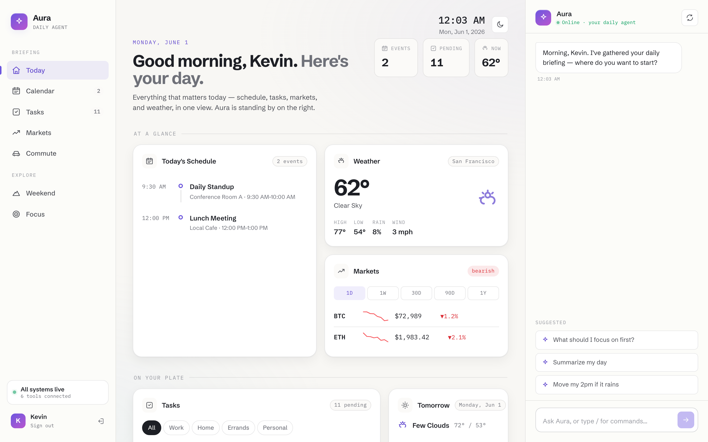
  </picture>
</p>

Aura is a unified monorepo combining a React Router v7 frontend, a LangChain orchestration agent, and an MCP Server exposing ~22 productivity tools. It runs as a single-user app gated by Google OAuth, with a brain-vault integration that lets the agent answer questions from a personal knowledge base.

**Live:** <https://daily-agent-ui.vercel.app> · **Agent:** <https://aura-agent.fly.dev> · **MCP Server:** <https://aura-mcp-server.fly.dev>

---

## Highlights

### Daily briefing — schedule, weather, markets, tasks, all in one view
The "Today" surface bundles the things you actually need at 8am. Auto light/dark theming follows system preference.

<table>
  <tr>
    <td width="50%">
      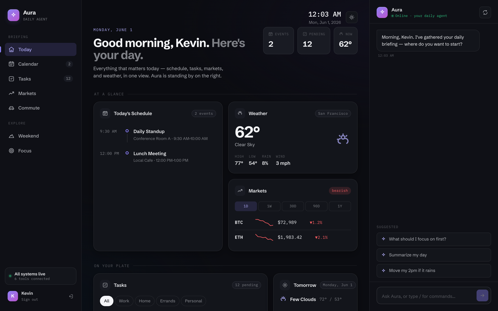
      <p align="center"><sub>Today · dark</sub></p>
    </td>
    <td width="50%">
      
      <p align="center"><sub>Today · light</sub></p>
    </td>
  </tr>
</table>

### Calendar — today + tomorrow, with "leave by" hints

<p align="center">
  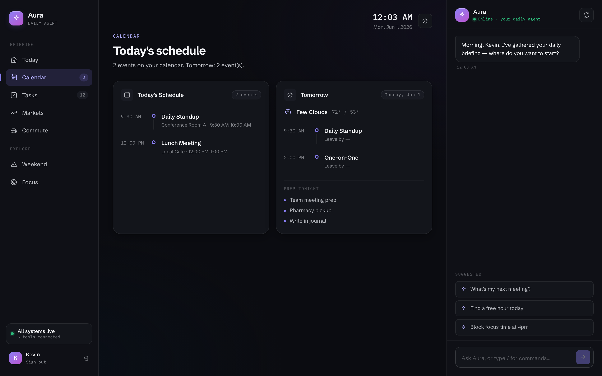
</p>

The calendar surface joins Google Calendar with the commute engine so each event gets a "leave by" suggestion based on real-time traffic.

### Tasks — Todoist, grouped by project bucket

<p align="center">
  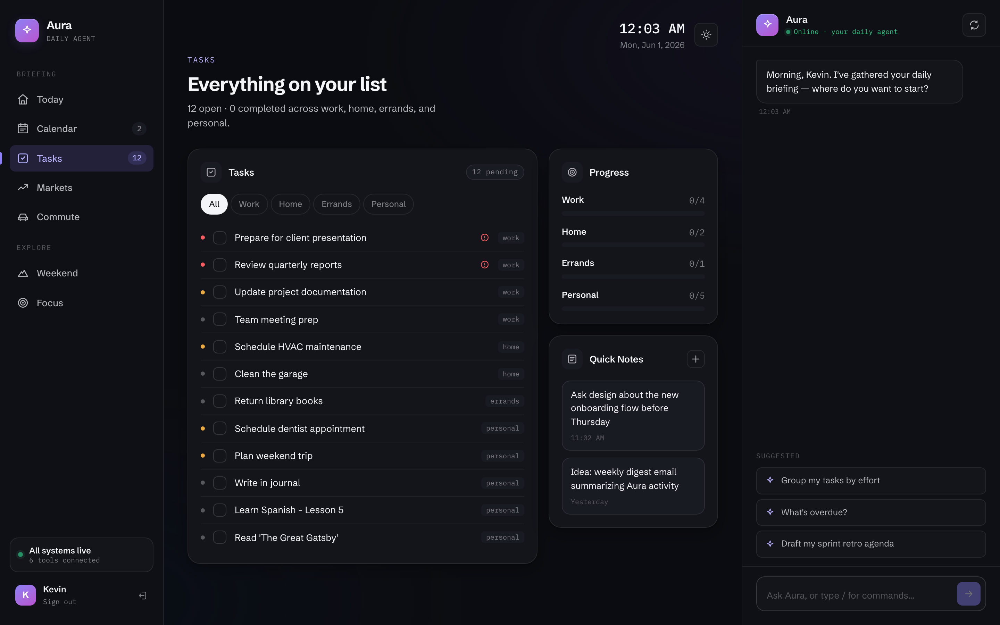
</p>

Filterable by Work / Home / Errands / Personal, with progress per bucket and a quick-notes scratchpad.

### Markets — equities + crypto, with range toggles

<p align="center">
  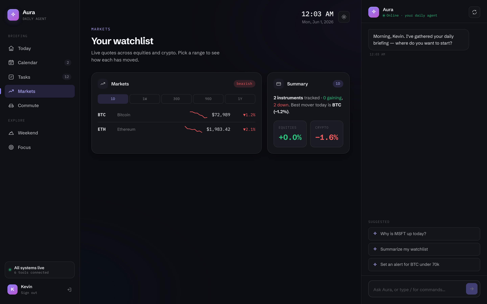
</p>

Live quotes via Alpha Vantage + CoinGecko, cached aggressively (5-min TTL) to stay within free-tier limits.

### Commute — driving vs. transit, with shuttle awareness

<p align="center">
  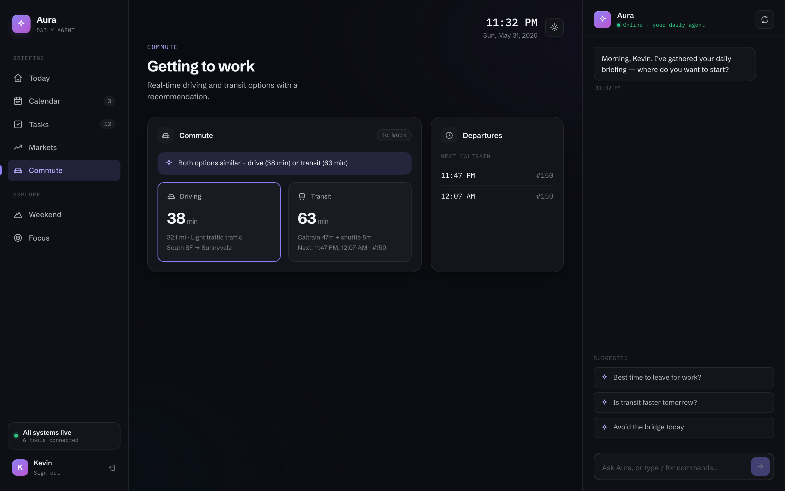
</p>

Combines Google Maps directions, the Caltrain GTFS feed, and the MV Connector shuttle schedule into a single "best way to get to work right now" recommendation.

### Weekend planner — trails, concerts, itineraries

<p align="center">
  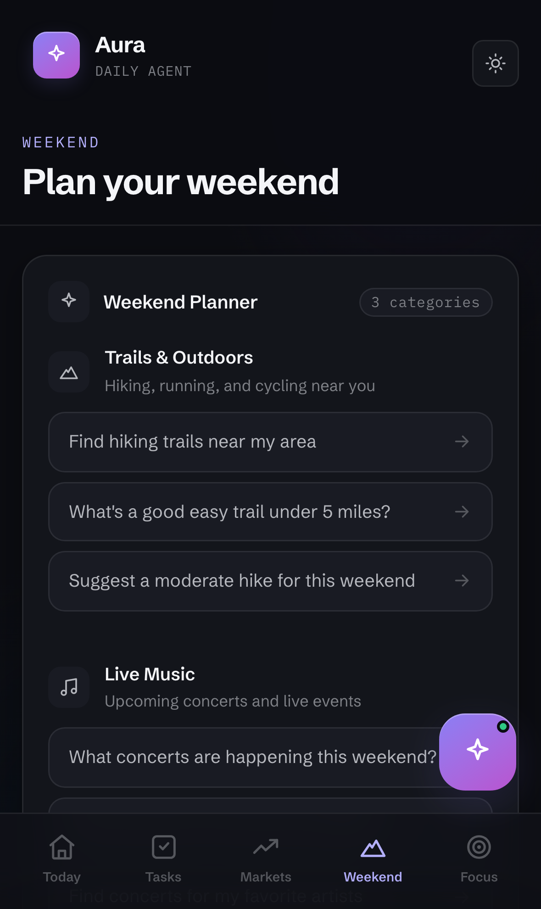
</p>

Suggests hikes near you (Google Places), pulls live concert listings (Ticketmaster), and can stitch them into multi-stop weekend itineraries — falls back to JSON fixtures if API keys aren't set.

### Conversational copilot — slash commands + suggested prompts

<table>
  <tr>
    <td width="40%">
      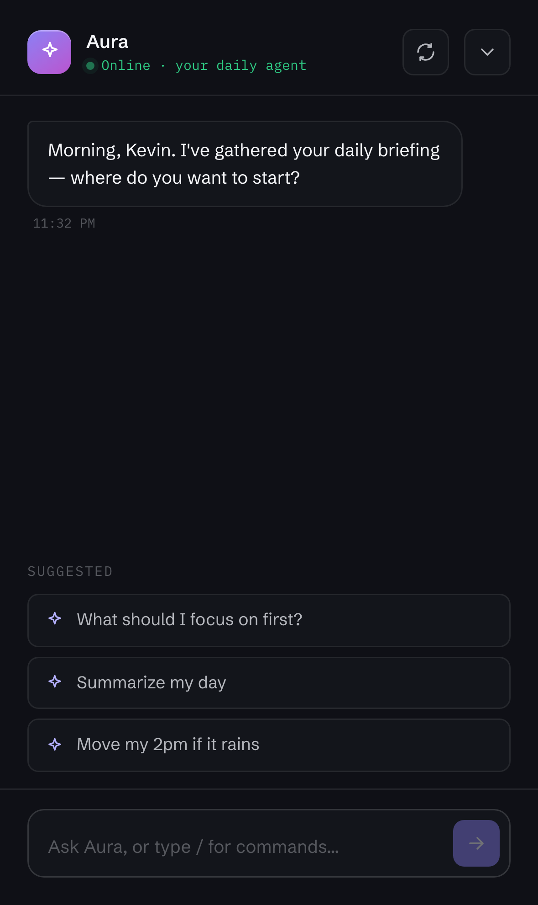
      <p align="center"><sub>Copilot sheet · mobile</sub></p>
    </td>
    <td width="60%">
      <p>Ask Aura anything — your data is already in context. Type <code>/</code> to access slash commands:</p>
      <ul>
        <li><code>/summary</code> — narrative recap of your day</li>
        <li><code>/weather</code> — full forecast with rain/wind</li>
        <li><code>/finance</code> — current holdings + movers</li>
        <li><code>/help</code> — list every command</li>
      </ul>
      <p>Suggested prompts adapt to whichever surface you're on (Today, Tasks, Markets, …).</p>
    </td>
  </tr>
</table>

### Mobile — same data, redesigned for a thumb

<table>
  <tr>
    <td width="33%">
      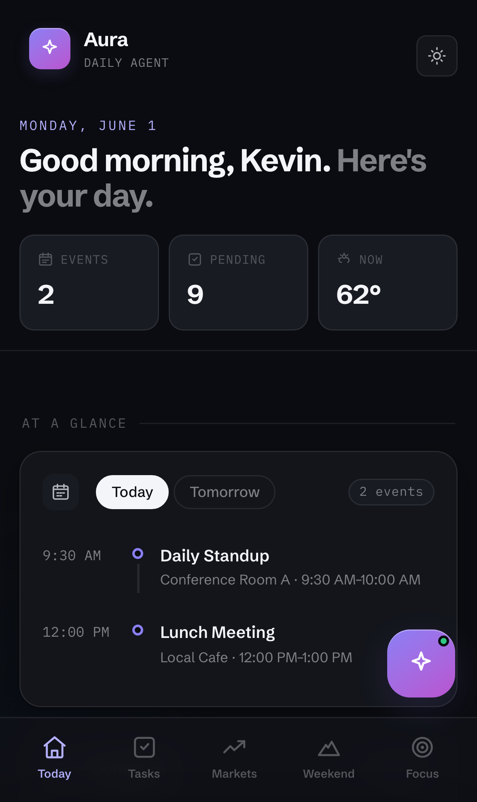
      <p align="center"><sub>Today (top)</sub></p>
    </td>
    <td width="33%">
      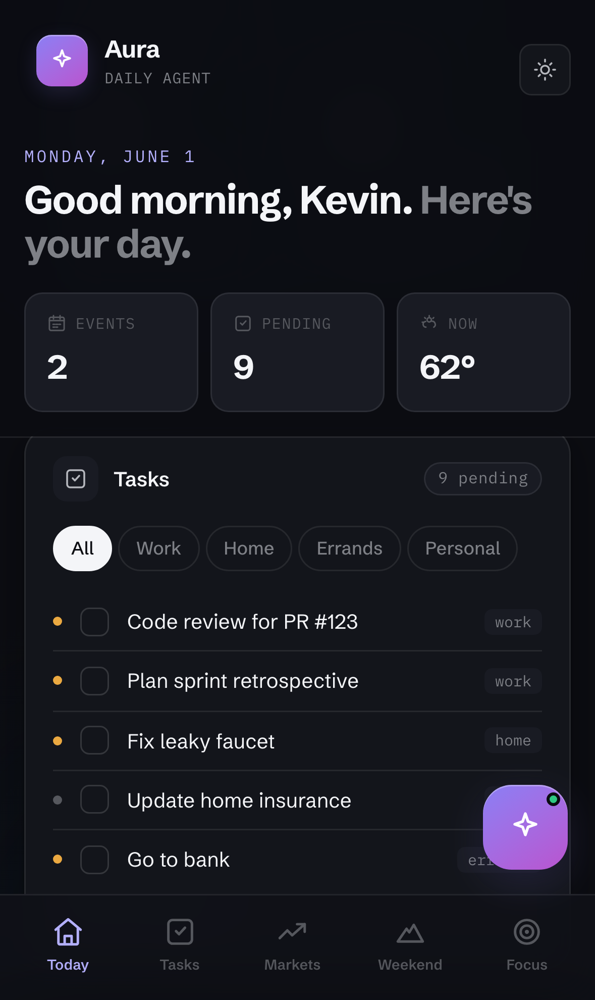
      <p align="center"><sub>Today (tasks)</sub></p>
    </td>
    <td width="33%">
      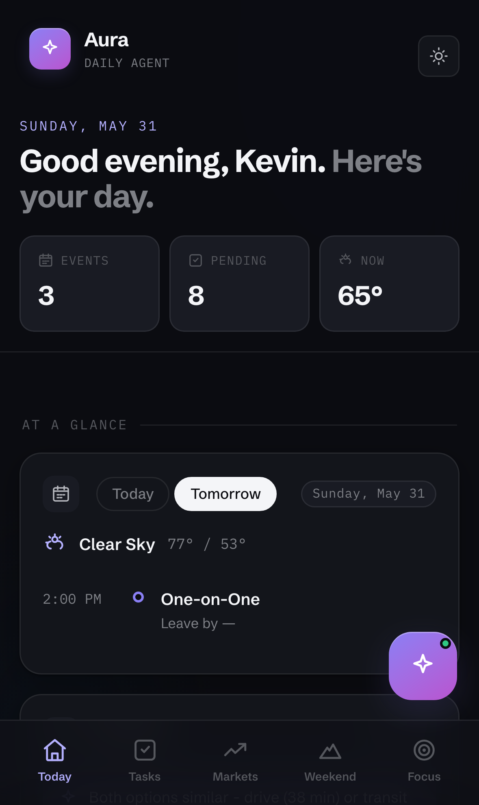
      <p align="center"><sub>Schedule · Tomorrow</sub></p>
    </td>
  </tr>
  <tr>
    <td width="33%">
      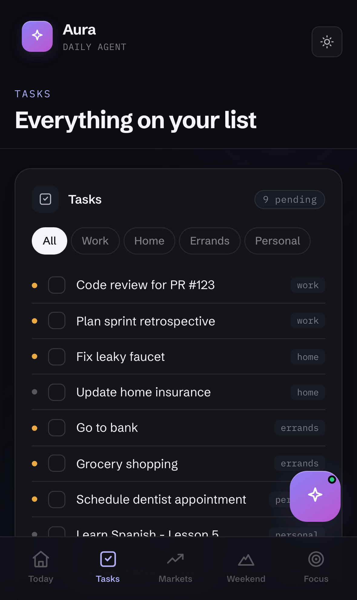
      <p align="center"><sub>Tasks</sub></p>
    </td>
    <td width="33%">
      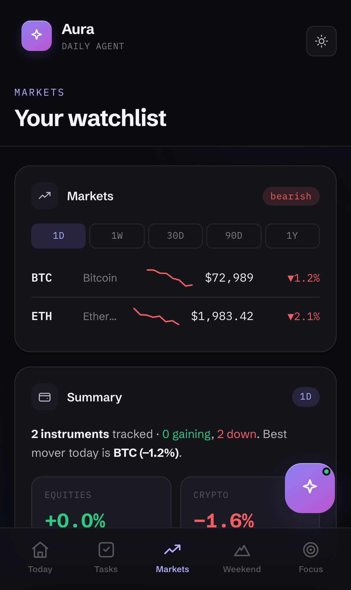
      <p align="center"><sub>Markets</sub></p>
    </td>
    <td width="33%">
      
      <p align="center"><sub>Weekend</sub></p>
    </td>
  </tr>
</table>

### Login — Google OAuth, allowlist-gated

<table>
  <tr>
    <td width="50%">
      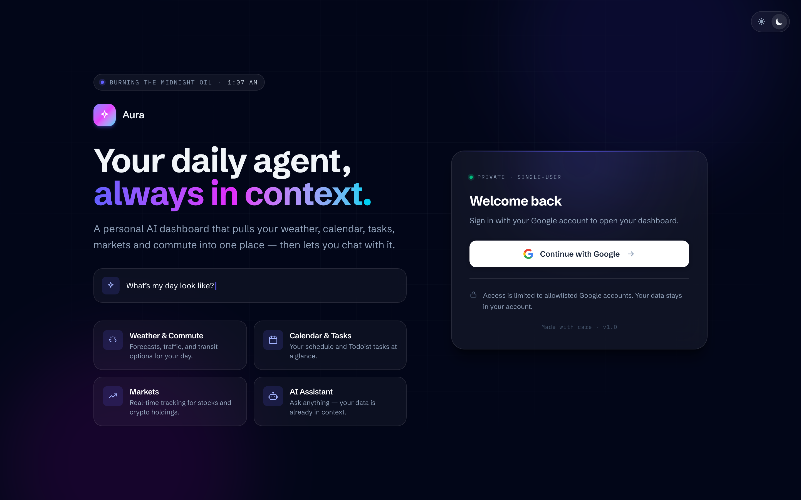
      <p align="center"><sub>Login · dark</sub></p>
    </td>
    <td width="50%">
      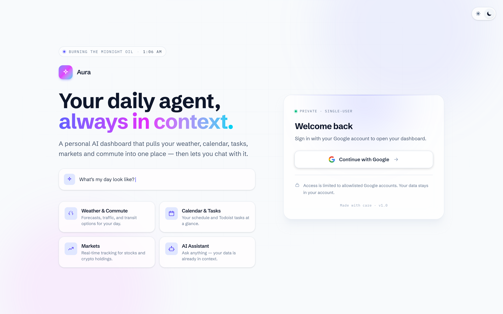
      <p align="center"><sub>Login · light</sub></p>
    </td>
  </tr>
</table>

---

## Architecture

```
Browser ─▶ UI (5173, React Router v7, auth boundary)
             │
             ▼  /api/v1/* proxy + X-Internal-Auth + X-User-Email
          Agent (8001, LangChain + GPT-4o-mini)
             │
             ▼  MCP / SSE
          MCP Server (8000, FastAPI)
             │
             ▼
       External APIs + Redis + Brain-Vault (git-synced)
```

Claude Desktop, Cursor, and other MCP clients can also connect directly to the MCP Server at `/mcp/sse` — they bypass the UI/Agent entirely.

## Features

**Daily intelligence**
- Weather (current + 7-day forecast) via OpenWeatherMap
- Google Calendar — read events, create/update/delete, `find_free_time` for scheduling
- Todoist — full CRUD over tasks, grouped by project bucket
- Commute — driving + transit options with real-time traffic, plus Caltrain GTFS and MV Connector shuttle schedules
- Markets — equities (Alpha Vantage) and crypto (CoinGecko) with watchlist + range toggles

**Weekend orchestrator**
- Trail suggestions near a location (Google Places)
- Live concert listings (Ticketmaster Discovery API)
- Multi-day itinerary composer that stitches the above together
- Graceful degradation: falls back to bundled JSON fixtures if any external key is unset

**Conversational copilot**
- LangChain agent over GPT-4o-mini, wired to every MCP tool as a typed LangChain tool
- Slash commands (`/summary`, `/weather`, `/finance`, `/help`) for fast common actions
- Streaming chat responses through the UI proxy

**Brain-vault integration**
- `vault_search`, `vault_read`, `vault_list` MCP tools backed by a sparse-checkout clone of `~/Projects/brain-vault`
- Lets the agent answer "what did I do last week?" / "tell me about project X" from personal notes

**Auth & security**
- Google OAuth + email allowlist on the UI
- UI is the auth boundary; Agent re-validates a shared-secret + verified-email header on every request
- Session cookies signed with a separate `SESSION_SECRET`
- No browser-side secrets — everything routes through `/api/v1/*` proxies on the UI server

**Infra**
- Redis cache (with per-service in-memory fallback) — Weather 30min, Financial 5min, Routes 15min, Geocoding 7d
- Docker Compose for local dev, Fly.io for Python services, Vercel for the UI
- Brain-vault syncs as a git sparse-checkout so the server only pulls the folders it needs

## Tech Stack

| Layer | Stack |
| --- | --- |
| Frontend | React Router v7, TypeScript, Tailwind CSS, Vitest |
| AI Agent | Python 3.13, LangChain, GPT-4o-mini, Flask |
| MCP Server | Python 3.11, FastAPI, official MCP SDK (SSE transport) |
| Cache | Redis (+ in-memory fallback) |
| Auth | Google OAuth 2.0, signed session cookies, shared-secret service-to-service hop |
| External APIs | Google Calendar, Google Maps + Places, OpenWeatherMap, Todoist, Alpha Vantage, CoinGecko, Ticketmaster, Caltrain GTFS |
| Deploy | Fly.io (`aura-agent`, `aura-mcp-server`), Vercel (UI) |
| Tooling | Docker Compose, `uv` (Python), `npm` (Node), Make, Playwright (E2E) |

## Quick Start

Prereqs: Docker (Desktop or Engine), Docker Compose, and `make`. Nothing else needs to be installed locally — every service runs in a container.

    cp .env.example .env
    # Edit .env with your API keys + auth secrets (see CLAUDE.md for details)
    make dev

Minimum secrets to actually log in:

- `GOOGLE_CLIENT_ID` + `GOOGLE_CLIENT_SECRET` — Google OAuth client
- `SESSION_SECRET` + `INTERNAL_AUTH_SECRET` — generate each with `openssl rand -hex 32`
- `ALLOWED_EMAILS` — comma-separated list of emails permitted to sign in

The UI's session module throws on boot when `NODE_ENV=production` and either secret is missing; in dev it'll start but login will fail loudly if Google credentials or the allowlist aren't set.

## Services

| Service | URL                   | Description                                |
| ------- | --------------------- | ------------------------------------------ |
| UI      | http://localhost:5173 | React Router v7 frontend (auth boundary)   |
| Agent   | http://localhost:8001 | LangChain AI agent (Flask, internal-only)  |
| Server  | http://localhost:8000 | MCP Server (FastAPI, productivity tools)   |
| Redis   | localhost:6379        | Cache layer for server tools               |

## Production

Both Python services run on Fly.io; the UI runs on Vercel (auto-deploy from `main`).

| Service    | Production URL                          |
| ---------- | --------------------------------------- |
| UI         | https://daily-agent-ui.vercel.app       |
| Agent      | https://aura-agent.fly.dev              |
| MCP Server | https://aura-mcp-server.fly.dev         |

Deploy from the monorepo root (build context needs paths from `packages/*/`):

    make fly-deploy            # both Python services
    make fly-server            # server only
    make fly-agent             # agent only

Set secrets per app with `fly secrets set KEY=value --app <app-name>`. See package-level `CLAUDE.md` files for the full secret list.

## Authentication

Aura is a **single-user app** gated by Google OAuth + an email allowlist. The UI is the auth boundary; the Agent is internal. See `CLAUDE.md` → *Authentication* for the full flow.

Browser calls never hit the Agent directly — they go through `/api/v1/*` routes on the UI server, which inject the shared-secret + verified-email headers before forwarding. Anything that polls **must** use a proxy route; bare browser fetches to the Agent will 401.

## Commands

    make dev          # Start all services (foreground)
    make up           # Start in background
    make down         # Stop all services
    make logs         # Tail logs
    make build        # Rebuild images
    make clean        # Remove containers, volumes, images
    make shell-server # Shell into the server container
    make shell-agent  # Shell into the agent container
    make redis-cli    # Open Redis CLI

    make e2e          # Smoke tests (no API keys needed)
    make e2e-full     # Full E2E suite (requires API keys)

    make deploy       # Build + start the prod docker-compose stack
    make fly-deploy   # Deploy server + agent to Fly.io

`make help` lists every target.

## Packages

- **`packages/server`** — MCP Server (FastAPI, Python 3.11+). ~22 tools across weather, calendar CRUD + `find_free_time`, todos CRUD (Todoist), commute intelligence (Google Maps + Caltrain GTFS + MV Connector), financial (Alpha Vantage + CoinGecko), the **weekend orchestrator** (trails / concerts / itineraries), and the **brain-vault tools** (`vault_search` / `vault_read` / `vault_list`) backed by a git-synced clone of `~/Projects/brain-vault`.
- **`packages/agent`** — AI Agent (Python 3.13+, LangChain + GPT-4o-mini). Wraps each MCP tool as a LangChain tool, runs the chat loop, and exposes a Flask REST API on port 8001. Re-validates the UI's auth headers as defense in depth.
- **`packages/ui`** — Web frontend (React Router v7, TypeScript, Tailwind). Dashboard widgets, AI chat with slash commands (`/summary`, `/weather`, `/finance`, …), weekend planner, Google-OAuth login. Server-rendered initial load; client polling goes through `/api/v1/*` proxy routes.

## MCP Clients

The server speaks the official Model Context Protocol over SSE, so any MCP-compatible client can use Aura's tools directly:

- **Claude Desktop** — stdio (subprocess) entry; URL-based entries are silently dropped by current builds. See `packages/server/CLAUDE.md` → *MCP Protocol Support* for the working config.
- **Cursor / raw MCP SDK** — connect to `/mcp/sse` (locally `http://localhost:8000/mcp/sse`, prod `https://aura-mcp-server.fly.dev/mcp/sse`).

> **Known caveat:** Claude Desktop's chat API rejects tool names containing dots. All Aura tools were renamed to `namespace_action` (e.g. `weather_get_daily`), so Cursor and the Aura UI work today; Claude Desktop chat compatibility is tracked in a follow-up.

## Testing

Cross-service smoke + E2E run from the monorepo root and use Docker only:

```bash
make e2e        # smoke (no API keys needed)
make e2e-full   # full suite (requires API keys)
```

Per-package suites assume you've installed the local toolchain (`uv` for Python, `npm` for the UI) — see each package's `CLAUDE.md`:

```bash
# packages/server
uv run pytest --cov=mcp_server

# packages/agent
uv run pytest --cov=daily_ai_agent

# packages/ui
npm run typecheck && npm test   # Vitest
```

## Repository Layout

```
aura/
├── packages/
│   ├── server/                # MCP Server (FastAPI + MCP SDK)
│   ├── agent/                 # LangChain agent (Flask REST)
│   └── ui/                    # React Router v7 frontend
├── docker/                    # Per-service Dockerfiles
├── docker-compose*.yml        # Dev / prod / e2e stacks
├── e2e/                       # Cross-service Playwright smoke + full E2E
├── fly/                       # Fly.io config helpers
├── scripts/                   # One-off ops scripts (vault sync, etc.)
├── docs/                      # Architecture docs + screenshots
└── .claude/                   # Project-local Claude Code skills + hooks
```

## 🤖 Claude Code Integration

This project ships custom Claude Code skills and hooks under `.claude/`:

```bash
./.claude/setup.sh
```

See [.claude/README.md](.claude/README.md) and [.claude/QUICKSTART.md](.claude/QUICKSTART.md).

## Documentation

- **[CLAUDE.md](./CLAUDE.md)** — architecture, auth flow, env vars, common tasks
- **[packages/server/CLAUDE.md](./packages/server/CLAUDE.md)** — server tools, caching, MCP protocol
- **[packages/agent/CLAUDE.md](./packages/agent/CLAUDE.md)** — LangChain tools, orchestration, preferences
- **[packages/ui/CLAUDE.md](./packages/ui/CLAUDE.md)** — components, routing, auth proxy
- **[packages/server/WEEKEND_ORCHESTRATOR_SPEC.md](./packages/server/WEEKEND_ORCHESTRATOR_SPEC.md)** — weekend feature spec
- **[packages/agent/ORCHESTRATOR_DESIGN.md](./packages/agent/ORCHESTRATOR_DESIGN.md)** — orchestrator design notes
- **[docs/brain-vault-integration.md](./docs/brain-vault-integration.md)** — brain-vault rollout plan + architecture
